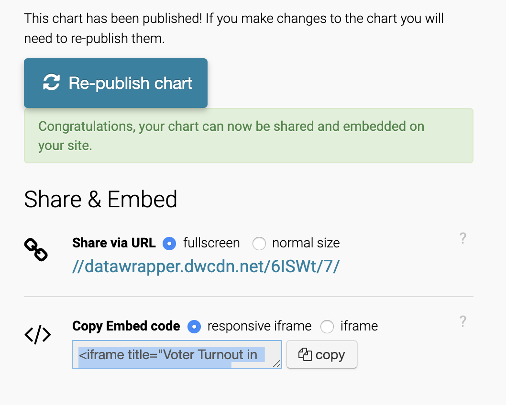

# Are hospitals enough for different NCY areas during pandemic?

### As we can see from the dataset of confirmed NYC positive cases in NYC on zip code provided by NYC Department of Health and Mental Hygiene on Github, areas in Queens have the most cases in NYC, but are there sufficient hospitals in those areas to support medical services for infected people? With the coronavirus is getting worse and worse in NYC, I also collected zip code of NYC hospitals, so I'm able to use both of the datasets to make an interactive map to show locations of NYC hospitals and confirmed cases in those areas.

What else has been done on this topic (provide links)? How is your angle different or fresh?

-   [Related headline (Coronavirus in the U.S.: Latest Map and Case Count)](https://www.nytimes.com/interactive/2020/us/coronavirus-us-cases.html)
-   [Related headline (Reuters)](https://graphics.reuters.com/CHINA-HEALTH-MAP/0100B59S39E/index.html)

Describe how and where you found the data with links to sources. Put the raw data (csv format) in a folder called `data` in this folder. Make a folder called `notebooks` where you will write your pandas code.

-   The first data I found is from [NYC Department of Health and Mental Hygiene](https://github.com/baidiwang/coronavirus-data/blob/master/tests-by-zcta.csv).
-   The second data I found is from a[NY Government PDF document](https://ag.ny.gov/sites/default/files/press-releases/archived/NYSHospitalsByCounty.pdf).

Write up at least one or up to three findings from your analysis based on the data you found.

-   Queens has the least hospitals in NYC while having the most cases confirmed compared with other boroughs.
-   Manhattan has the opposite situation compared with Queens, as Manhattan has the most hospitals with less cases in NYC.
-   Bronx and Staten Island has the same issues as Queens. 

Who are some potential human sources you could reach out to for more info?

-   I will talk with related officers at NYC government who are responsible for tracking coronavirus.
-   Also doctors working at different NYC hospitals.
-   Residents live in different areas based on zip code.

What is the maximum (best) story possible? What's the minimum (fallback) story if your hypothesis doesn't prove out?

-   I think the story will be easier to tell, as I have collected sufficient data, but it may still fail if the result shows there are actually more hospitals in an area with more confirmed cases than another area with less hospitals.

## How to publish and submit your project

1.  Make sure you have navigated to your `data-journalism` folder with your terminal first. Clone a fresh copy of this template and navigate to the folder.

        git clone git@github.com:JOUR73351/pandas-project.git NAME-OF-YOUR-PROJECT-HERE
        cd NAME-OF-YOUR-PROJECT-HERE

2) Remove my git tracking from the project

    rm -rf .git

3) Create a new repository on GitHub called `NAME-OF-YOUR-PROJECT-HERE` with the following settings.
    
   

4) Run these git commands to initialize the repo. Make sure you've checked `ssh`.

    git init
    git add -A
    git commit -m "first commit"
    git remote add origin git@github.com:YOUR-USERNAME-HERE/YOUR-REPO-HERE.git
    git push -u origin master

5) Write your pitch in `README.md`.

6) Write your story in and add your assets and charts to `index.html`. Feel free to play around with and change the styles in `style.css`, but you are not required to. Delete the code that you don't need for your story. The story itself should be no less than 150 words and include at least one chart from Datawrapper. You can embed a Datawrapper chart in your story by copying the embed code into your html as I have done in `index.html.`
    
   

7) You can preview a local version of your story by running a python server.

    python -m SimpleHTTPServer 8000

   Then, navigate to `http://localhost:8000` in your browser. Before step 8, you must quit the python server by pressing `ctrl+c`.

8) To save a version of your story on GitHub, run the following git commands.

    git add -A
    git commit -m "YOUR-COMMIT-MESSAGE-HERE"
    git push

9) To publish, go to the settings of your GitHub repo, scroll down to GitHub Pages, and configure the source to the master branch.
   
